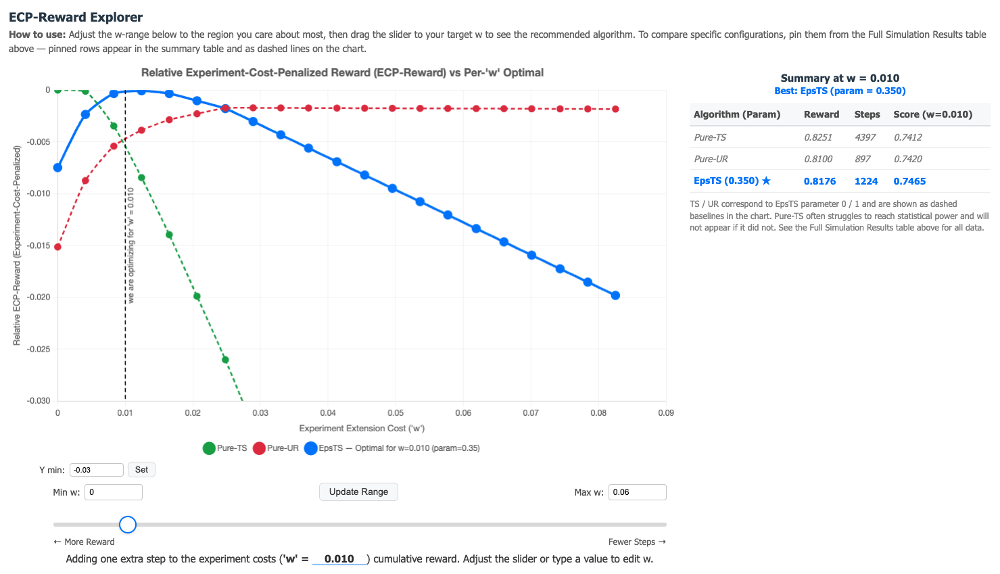

# Bandit Simulation

Simulation framework for multi-armed bandit experiments with hypothesis testing, used in the paper **A Statistically Reliable Optimization Framework for Bandit Experiments in Scientific Discovery**.

---

## Setup

```bash
python -m venv .venv
source .venv/bin/activate
pip install -e .
```

---

## Interactive Web App

A local web application is included for configuring and running bandit simulations through a browser interface.

```bash
cd webapp
python app.py
```

Then open [http://localhost:8000](http://localhost:8000) in your browser.

**Walkthrough:**

1. **Input page** — Configure the experiment: number of arms, reward distribution, hypothesis test, and algorithm sweep. Or load a saved scenario (e.g., "Example: Empirical study inspired setting") to skip configuration entirely.
2. **Run** — Click "Run Simulation". A progress bar shows live status and intermediate results as each configuration completes.
3. **Output page** — Explore results with an interactive ECP-Reward chart and summary table. Drag the *w* slider to see how the experiment extension cost changes the optimal algorithm. Pin rows from the full results table to compare specific configurations on the chart. A guided tour is available on first visit.
4. **Iterate** — Run additional algorithm configurations directly from the output page without going back. Save interesting scenarios for later.

---

## Project Structure

```
bandit_simulation/   Core library (bandit algorithms, simulation engine, Bayesian models)
configs/             YAML experiment configurations (one per table/figure)
scripts/             Entry points: run_from_config.py + plot scripts
results/             Pre-computed simulation CSVs (included in repo)
webapp/              Interactive web application
```

---

## Running Experiments

Simulation experiments are defined as YAML config files in `configs/`. Run any experiment with:

```bash
python scripts/run_from_config.py configs/<config>.yaml
```

Results are saved to `results/<config>.csv` by default. Pre-computed results are included in the repository, so you can skip the simulation step and go straight to plotting.

To create your own experiment, copy `configs/template.yaml` and adjust the settings. YAML configs support algorithm sweeps, test procedure sweeps, and distribution sweeps (with `linspace`/`arange` shorthand for parameter grids).

---

## Reproducing Paper Results

All commands run from the project root. Pre-computed results are included in `results/` so you can skip the simulation step if you just want to inspect results or generate figures. Estimated run times are on a modern laptop (Apple M-series or equivalent).

---

### Figure 1 — Interactive Web App

The web app can also produce Figure 1 from the paper. The landing page is pre-filled with the same configuration used in the paper, so you can click "Run Simulation" to reproduce Figure 1 directly. A pre-computed version is also included as a saved scenario: click **"Example: Empirical study inspired setting"** to go directly to the results analysis page without re-running the simulation.



---

### Table 1 — Wald Test FPR Under Adaptive Sampling

Analyzes how the Wald test statistic distribution deviates from N(0,1) under Thompson Sampling, and compares false positive rates between a fixed classical threshold (from z-table) and our proposed algorithm-induced test (AIT) correction.

*This script uses a custom simulation loop (not the standard sweep pipeline). Runs in ~2 minutes.*

```bash
python scripts/wald_fpr_analysis.py
```

---

### Table 2 — ART vs AIT for Two-Sample t-tests (Power and FPR)

Compares the empirical power and false positive rate (FPR) of Algorithm-Induced Test correction (AIT) versus Algorithm Replay Test correction (ART) when data are collected adaptively by common bandit algorithms. We consider a two-sample t-test for the composite hypothesis H0: mu1 = mu2 against H1: mu1 != mu2, with total horizon T = 200 and Bernoulli rewards.

*This script uses a custom simulation loop with its own replay logic (not the standard sweep pipeline). Runs in ~1 hour.*

```bash
python scripts/ait_art_comparison.py
```

---

### Table 3 & Figure 1 — Empirically Inspired Simulation (Prior vs Post Evaluation)

Illustrates how the proposed optimization framework guides adaptive experiment design under an empirically inspired 6-arm simulation. 

**Prior (design-time optimization):**

Figure 1 shows the relative ECP-reward performance across epsilon-TS settings. The visualization compares epsilon-TS against TS (epsilon = 0) and UR (epsilon = 1) across different experiment extension costs w.

*Runs in ~30 minutes.* Again, you can also run it on the web app or view these results instantly in the web app by loading the saved scenario **"Example: Empirical study inspired setting"** (see above).

```bash
python scripts/run_from_config.py configs/table3_prior.yaml
python scripts/plot_table3_prior.py
```

**Post (realized performance evaluation):**

Table 3 compares experiment designs (UR, TS, epsilon-TS) using the empirical arm means at the horizons determined during the prior optimization stage.

*Runs in ~3 minutes (two configs).*

```bash
python scripts/run_from_config.py configs/table3_post_ts.yaml
python scripts/run_from_config.py configs/table3_post_epsts.yaml
python scripts/plot_table3_post.py
```

---

### Table 4 — Evaluation Across Hypothesis Tests

Evaluates the proposed optimization procedure across multiple hypothesis tests (ANOVA, T-Constant, T-Control, Tukey) and bandit algorithms under a unified reward-inference tradeoff framework. Type I error fixed at 0.05, power constraint fixed at 0.8.

*Runs in ~30 minutes.*

```bash
python scripts/run_from_config.py configs/table4.yaml
```

---

### Table 5 — Prior Mis-specification Sensitivity Check

Evaluates robustness of the optimization framework under prior mis-specification. Sweeps the true distribution across 7 Beta priors with varying means (location mis-specification). For scale mis-specification, see comments in the config file.

*Runs in ~1 hour.*

```bash
python scripts/run_from_config.py configs/table5.yaml
```
